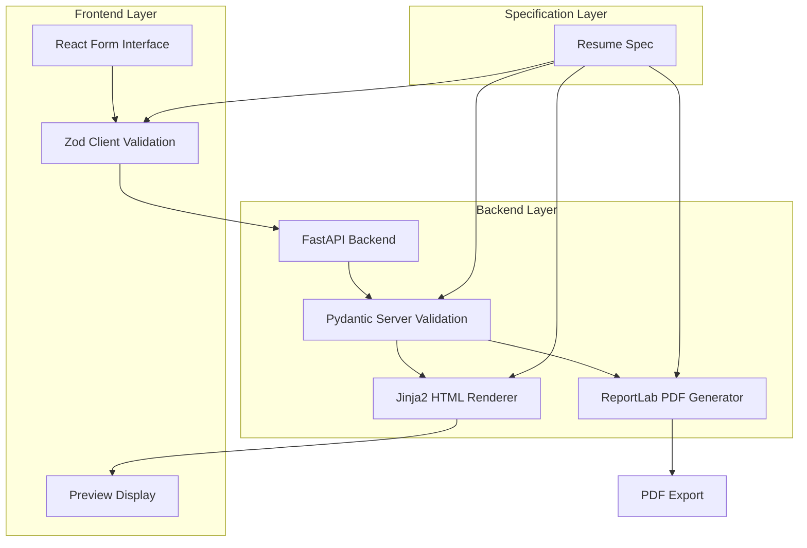

# Design Document: Indexnine Resume Builder

## Overview

The Indexnine Resume Builder is a spec-driven system that enforces strict validation and generates company-compliant resumes without AI assistance. The system follows a rigid pipeline: structured data input → validation → HTML preview → PDF export, ensuring consistent formatting between preview and final document.

The architecture prioritizes Indexnine behavior over flexibility, with the Resume_Spec serving as the single source of truth for all validation, rendering, and export operations.

## Architecture

### System Architecture



### Data Flow Pipeline

1. **Input Collection**: React Hook Form collects structured data across seven sections
2. **Client Validation**: Zod schemas validate data in real-time, mirroring server validation
3. **Server Validation**: Pydantic models enforce spec compliance with detailed error reporting
4. **HTML Generation**: Jinja2 templates render validated data using Company_Template structure
5. **Preview Display**: HTML preview displays in isolated iframe with consistent formatting
6. **PDF Generation**: ReportLab creates final document using same data structure and formatting

## Components and Interfaces

### Frontend Components

#### Form Interface Component
```typescript
interface ResumeFormData {
  header: HeaderSection;
  expertise: ExpertiseSection;
  skills: SkillsSection;
  experience: ExperienceSection[];
  projects: ProjectSection[];
  education: EducationSection[];
  awards?: AwardSection[];
}

interface FormSectionProps {
  data: any;
  errors: FieldErrors;
  register: UseFormRegister<ResumeFormData>;
  control: Control<ResumeFormData>;
}
```

**Responsibilities:**
- Render seven fixed sections with appropriate input controls
- Provide real-time validation feedback using Zod schemas
- Disable export functionality until all validation passes
- Display section-specific error messages with spec references

#### Preview Component
```typescript
interface PreviewProps {
  htmlContent: string;
  isValid: boolean;
  validationErrors: ValidationError[];
}
```

**Responsibilities:**
- Display HTML preview in isolated iframe
- Show validation errors when data is invalid
- Update preview in real-time as form data changes
- Maintain identical styling to DOCX output

### Backend Components

#### Validation Models
```python
from pydantic import BaseModel, Field, validator
from typing import List, Optional
from datetime import date

class HeaderModel(BaseModel):
    name: str = Field(..., min_length=1, max_length=100)
    title: str = Field(..., min_length=1, max_length=150)
    email: str = Field(..., regex=r'^[^@]+@[^@]+\.[^@]+$')
    phone: str = Field(..., regex=r'^\+?[\d\s\-\(\)]+$')
    location: str = Field(..., min_length=1, max_length=100)

class ExpertiseModel(BaseModel):
    summary: str = Field(..., min_length=80, max_length=120)
    
    @validator('summary')
    def validate_word_count(cls, v):
        word_count = len(v.split())
        if not 80 <= word_count <= 120:
            raise ValueError(f'Summary must be 80-120 words, got {word_count}')
        return v

class ExperienceModel(BaseModel):
    company: str = Field(..., min_length=1, max_length=100)
    position: str = Field(..., min_length=1, max_length=100)
    start_date: str = Field(..., regex=r'^[A-Z]{3} \d{4}$')
    end_date: Optional[str] = Field(None, regex=r'^[A-Z]{3} \d{4}$|^Present$')
    responsibilities: List[str] = Field(..., min_items=3)
    
    @validator('responsibilities')
    def validate_responsibilities(cls, v):
        if len(v) < 3:
            raise ValueError('Minimum 3 responsibilities required')
        return v
```

#### Rendering Engine
```python
from jinja2 import Environment, FileSystemLoader
from reportlab.lib.pagesizes import letter
from reportlab.lib.styles import getSampleStyleSheet, ParagraphStyle
from reportlab.platypus import SimpleDocTemplate, Paragraph, Spacer
import io

class ResumeRenderer:
    def __init__(self, template_path: str):
        self.jinja_env = Environment(loader=FileSystemLoader(template_path))
        self.html_template = self.jinja_env.get_template('resume.html')
        
    def render_html(self, resume_data: ResumeModel) -> str:
        """Generate HTML preview with consistent PDF formatting"""
        return self.html_template.render(resume=resume_data)
        
    def generate_pdf(self, resume_data: ResumeModel) -> bytes:
        """Generate PDF using ReportLab with professional formatting"""
        buffer = io.BytesIO()
        doc = SimpleDocTemplate(buffer, pagesize=letter)
        story = self._build_pdf_content(resume_data)
        doc.build(story)
        return buffer.getvalue()
```

### API Endpoints

#### Validation Endpoint
```python
@app.post("/api/validate")
async def validate_resume(resume_data: ResumeModel) -> ValidationResponse:
    """Validate resume data against spec"""
    try:
        validated_data = ResumeModel(**resume_data.dict())
        return ValidationResponse(valid=True, data=validated_data)
    except ValidationError as e:
        return ValidationResponse(valid=False, errors=e.errors())
```

#### Preview Generation Endpoint
```python
@app.post("/api/preview")
async def generate_preview(resume_data: ResumeModel) -> PreviewResponse:
    """Generate HTML preview for validated data"""
    renderer = ResumeRenderer(template_path="templates")
    html_content = renderer.render_html(resume_data)
    return PreviewResponse(html=html_content)
```

#### Export Endpoint
```python
@app.post("/api/export")
async def export_pdf(resume_data: ResumeModel) -> Response:
    """Generate PDF file for validated data"""
    renderer = ResumeRenderer(template_path="templates")
    pdf_bytes = renderer.generate_pdf(resume_data)
    
    return Response(
        content=pdf_bytes,
        media_type="application/pdf",
        headers={"Content-Disposition": "attachment; filename=resume.pdf"}
    )
```

## Data Models

### Resume Specification Schema

```python
class ResumeModel(BaseModel):
    """Complete resume data model enforcing spec compliance"""
    header: HeaderModel
    expertise: ExpertiseModel
    skills: SkillsModel
    experience: List[ExperienceModel]
    projects: List[ProjectModel]
    education: List[EducationModel]
    awards: Optional[List[AwardModel]] = []
    
    class Config:
        validate_assignment = True
        extra = "forbid"  # Prevent additional fields
        
    @validator('experience')
    def validate_experience_order(cls, v):
        """Ensure experiences are in reverse chronological order"""
        # Implementation for date ordering validation
        return v
```

### Frontend Type Definitions

```typescript
// Mirror backend models exactly
export interface ResumeData {
  header: HeaderData;
  expertise: ExpertiseData;
  skills: SkillsData;
  experience: ExperienceData[];
  projects: ProjectData[];
  education: EducationData[];
  awards?: AwardData[];
}

// Zod schemas matching Pydantic models
export const ResumeSchema = z.object({
  header: HeaderSchema,
  expertise: ExpertiseSchema,
  skills: SkillsSchema,
  experience: z.array(ExperienceSchema),
  projects: z.array(ProjectSchema),
  education: z.array(EducationSchema),
  awards: z.array(AwardSchema).optional(),
});
```

## Correctness Properties

*A property is a characteristic or behavior that should hold true across all valid executions of a system—essentially, a formal statement about what the system should do. Properties serve as the bridge between human-readable specifications and machine-verifiable correctness guarantees.*

### Property-Based Testing Properties

Based on the prework analysis and property reflection, the following properties validate the system's correctness:

**Property 1: Real-time validation consistency**
*For any* resume data input across any section, validation should occur immediately without form submission and produce identical results between frontend Zod and backend Pydantic validation
**Validates: Requirements 1.2, 5.5, 7.5**

**Property 2: Validation error feedback completeness**
*For any* validation failure, the system should display section-specific error messages that reference the spec violation and highlight the specific field with the error
**Validates: Requirements 1.4, 2.6, 7.1, 7.2**

**Property 3: Export blocking on validation failure**
*For any* resume data that fails validation, the system should disable preview generation, export functionality, and the export button until all validation passes
**Validates: Requirements 2.7, 4.5, 7.3**

**Property 4: Date format validation**
*For any* date field input, the validation engine should accept only MMM YYYY format and reject all other date formats
**Validates: Requirements 2.2**

**Property 5: Expertise summary word count validation**
*For any* expertise summary text, the validation engine should accept only summaries between 80-120 words and reject summaries outside this range
**Validates: Requirements 2.3**

**Property 6: Experience responsibilities validation**
*For any* experience entry, the validation engine should require minimum 3 responsibilities and reject entries with fewer responsibilities
**Validates: Requirements 2.4**

**Property 7: Content sanitization**
*For any* text content across all sections, the validation engine should reject content containing emojis, icons, or graphics
**Validates: Requirements 2.5**

**Property 8: Preview update consistency**
*For any* valid data changes, the preview renderer should update the preview in real-time and display validation errors instead of preview content when data is invalid
**Validates: Requirements 3.2, 3.5**

**Property 9: Output format consistency**
*For any* valid resume data, the HTML preview and PDF export should maintain structural alignment with consistent section order and content organization
**Validates: Requirements 4.2, 8.3**

**Property 10: One-page output constraint**
*For any* valid resume data, the PDF generator should enforce one-page output limitation regardless of content length
**Validates: Requirements 4.4**

**Property 11: Processing pipeline order**
*For any* resume submission, the system should follow the exact pipeline order: Form Input → Spec Validation → Pydantic Validation → HTML Rendering → Preview Display → PDF Generation
**Validates: Requirements 8.1**

**Property 12: Skills format validation**
*For any* skills input, the validation engine should require comma-separated format and reject other formatting approaches
**Validates: Requirements 6.2**

**Property 13: Responsibilities format validation**
*For any* responsibilities input, the validation engine should require bullet-point format for all responsibility entries
**Validates: Requirements 6.3**

**Property 14: Section optionality validation**
*For any* resume data, the system should accept resumes without awards section but reject resumes missing any other required sections (Header, Expertise, Skills, Experience, Projects, Education)
**Validates: Requirements 6.4**

**Property 15: Layout immutability**
*For any* user interaction, the system should prevent adding custom sections, modifying section order, or applying dynamic layout modifications
**Validates: Requirements 1.3, 6.5, 8.5**

## Error Handling

### Validation Error Strategy

**Client-Side Error Handling:**
- Zod validation provides immediate feedback with field-level error highlighting
- Error messages reference specific spec violations with clear remediation guidance
- Form submission is blocked until all validation passes
- Real-time validation occurs on field blur and input change events

**Server-Side Error Handling:**
- Pydantic validation returns structured error responses with field paths
- HTTP 422 responses for validation failures with detailed error descriptions
- HTTP 500 responses for system errors with user-friendly messages
- All errors include error codes for programmatic handling

**Error Response Format:**
```json
{
  "valid": false,
  "errors": [
    {
      "field": "expertise.summary",
      "message": "Summary must be 80-120 words, got 65",
      "code": "WORD_COUNT_VIOLATION",
      "spec_reference": "Requirements 2.3"
    }
  ]
}
```

### Rendering Error Handling

**Preview Generation Errors:**
- Template rendering failures display technical error messages for developers
- Data serialization errors show field-specific validation guidance
- Network failures provide retry mechanisms with exponential backoff

**PDF Generation Errors:**
- File generation errors return appropriate HTTP status codes
- Content processing errors include diagnostic information
- Memory constraints trigger graceful degradation with user notification

## Testing Strategy

### Dual Testing Approach

The system requires both unit testing and property-based testing for comprehensive coverage:

**Unit Tests:**
- Specific examples demonstrating correct behavior for each validation rule
- Edge cases for boundary conditions (79 words, 121 words for expertise summary)
- Error conditions and exception handling scenarios
- Integration points between frontend and backend components
- API endpoint functionality with known inputs and expected outputs

**Property-Based Tests:**
- Universal properties that hold across all valid inputs using randomized data generation
- Comprehensive input coverage through property-based testing libraries
- Each correctness property implemented as a single property-based test
- Minimum 100 iterations per property test to ensure thorough validation

### Property-Based Testing Configuration

**Testing Framework:** 
- Backend: Hypothesis for Python property-based testing
- Frontend: fast-check for TypeScript property-based testing

**Test Configuration:**
- Each property test runs minimum 100 iterations with randomized inputs
- Tests tagged with format: **Feature: Indexnine-resume-builder, Property {number}: {property_text}**
- Property tests validate universal correctness properties from design document
- Unit tests validate specific examples and integration scenarios

**Test Data Generation:**
- Smart generators that constrain inputs to valid resume data domains
- Boundary condition testing for word counts, date formats, and field lengths
- Invalid input generation for testing validation rejection behavior
- Realistic resume data generation for end-to-end testing scenarios

### Testing Integration

**Continuous Validation:**
- Property tests run on every code change to catch regressions
- Unit tests provide fast feedback for specific functionality
- Integration tests validate complete user workflows
- Both test types are required for deployment approval

The combination of unit and property-based testing ensures both concrete correctness (unit tests) and universal correctness guarantees (property tests) across the entire system.

## UI Refactor Design

### Migration Strategy

The UI refactor migrates the existing functional components in `src/components/` to the new visual design found in `src/temp-ui/` while preserving all existing functionality, state management, and API integration.

### Component Mapping

**Existing → New Component Mapping:**
- `src/components/ResumeForm.tsx` → `src/temp-ui/components/resume/ResumeBuilder.tsx`
- Individual section components → `src/temp-ui/components/resume/*Section.tsx`
- Form controls → `src/temp-ui/components/resume/FormField.tsx`
- Preview component → `src/temp-ui/components/resume/ResumePreview.tsx`

### Preserved Functionality

**State Management:**
- React Hook Form integration with identical form structure
- Zod validation resolvers with same validation schemas
- Real-time validation feedback and error state management
- Form data watching and controlled input behavior

**API Integration:**
- Identical backend API calls for validation, preview, and export
- Same error handling and response processing
- Preserved network request patterns and data transformation

**User Experience Features:**
- "Fill Sample Data" functionality with same sample data
- Export PDF functionality with identical file generation
- Section collapsing/expanding behavior
- Real-time preview updates
- Validation error display and field highlighting

### New Visual Design Elements

**Enhanced UI Components:**
- Modern card-based section layout with improved visual hierarchy
- Collapsible sections with smooth animations using Framer Motion
- Improved form field styling with better error state visualization
- Professional header with branding and status indicators
- Responsive design with optimized mobile and desktop layouts

**Design System Integration:**
- Consistent color scheme using CSS custom properties
- Typography improvements with serif fonts for headings
- Enhanced spacing and layout using Tailwind CSS utilities
- Improved accessibility with proper ARIA labels and keyboard navigation

### Implementation Approach

**Phase 1: Component Structure Migration**
- Replace existing components with new visual components
- Maintain identical props interfaces and component APIs
- Preserve all existing React Hook Form integration

**Phase 2: Functionality Preservation**
- Ensure all validation logic remains identical
- Maintain same API integration patterns
- Preserve error handling and user feedback mechanisms

**Phase 3: Testing Compatibility**
- Ensure all existing tests continue to pass
- Maintain same component behavior for test assertions
- Preserve accessibility and user interaction patterns

### Technical Requirements

**Functional Compatibility:**
- All existing unit tests must pass without modification
- Property-based tests must continue to validate same behaviors
- API integration tests must maintain same request/response patterns
- Form validation must produce identical results

**Visual Enhancement:**
- Improved user experience with modern design patterns
- Better responsive behavior across device sizes
- Enhanced accessibility with improved focus management
- Professional appearance suitable for enterprise use